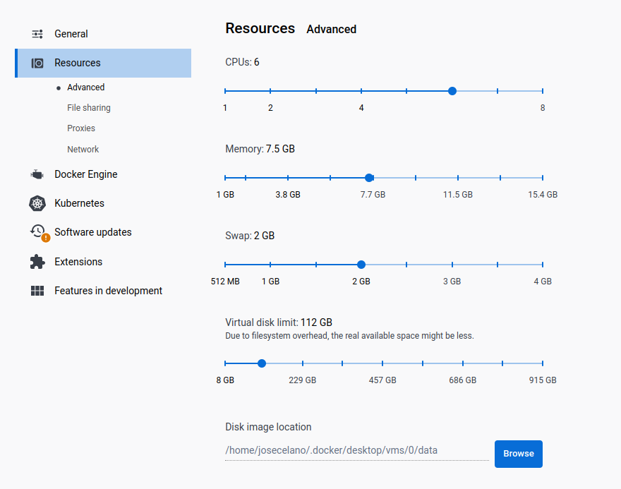

# Torrust Tracker on Ubuntu focal

This is a test repo just to check how to run [Torrust Tracker](https://github.com/torrust/torrust-tracker) on Ubuntu Focal.

Originally was created to help resolve [this issue](<https://github.com/torrust/torrust-tracker/issues/242>).

> DISCLAIMER!: the `Dockerfile` is not intended to be used on production. Database and `config.toml` are not persisted. Check the [official repo](https://github.com/torrust/torrust-tracker) for docker support for production.

## Setup

```s
git clone --recursive git@github.com:josecelano/torrust-tracker-on-ubuntu-focal.git
cd torrust-tracker-on-ubuntu-focal
docker build -t torrust-tracker-focal .
```

## Run

Run the dockerized tracker:

```s
docker run -it \
    --publish 6969:6969/udp \
    --publish 7070:7070/tcp \
    --publish 1212:1212/tcp \
    torrust-tracker-focal
```

After running it you should see something like this:

```s
Loading configuration from config file ./config.toml
2023-03-15T13:40:50.386169092+00:00 [torrust_tracker::logging][INFO] logging initialized.
2023-03-15T13:40:50.386306483+00:00 [torrust_tracker::jobs::udp_tracker][INFO] Starting UDP server on: udp://0.0.0.0:6969
2023-03-15T13:40:50.386315977+00:00 [torrust_tracker::jobs::http_tracker][INFO] Starting Torrust HTTP tracker server on: http://0.0.0.0:7070
2023-03-15T13:40:50.386420369+00:00 [torrust_tracker::jobs::http_tracker][INFO] Torrust HTTP tracker server started
2023-03-15T13:40:50.386437035+00:00 [torrust_tracker::jobs::tracker_apis][INFO] Starting Torrust APIs server on: http://0.0.0.0:1212
2023-03-15T13:40:50.386541507+00:00 [torrust_tracker::jobs::tracker_apis][INFO] Torrust APIs server started
```

Then you can, for example, load an API endpoint:

<http://localhost:1212/api/v1/stats?token=MyAccessToken>

## Commands

Build docker image:

```s
docker build -t torrust-tracker-focal .
```

Run bash inside the container:

```s
docker run -it --entrypoint bash torrust-tracker-focal
```

You should have these dependencies in the docker container:

```s
root@71c53a2c1269:/app# cargo --version
cargo 1.68.0 (115f34552 2023-02-26)
root@71c53a2c1269:/app# rustc --version
rustc 1.68.0 (2c8cc3432 2023-03-06)
```s

## Troubleshooting

The docker build process may stuck for a long time. If that's the case for you try to increase the docker resource limits:



## Links

GitHub Issues:

- <https://github.com/torrust/torrust-tracker/issues/242>
